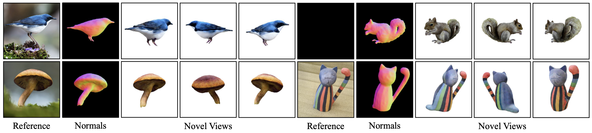
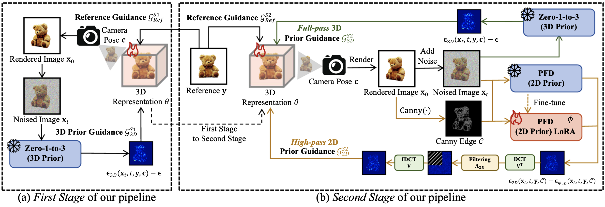

<div align="center">

# Single Image to Textured 3D Object Generation in Frequency Domain: From Theory to Pipeline

**Qisen Wang · Yifan Zhao<sup>*</sup> · Jia Li**

International Journal of Computer Vision (IJCV), 2026

[[Project Page]](https://icvteam.github.io/Morpheus3D.html) · [[Paper]](https://link.springer.com/article/10.1007/s11263-026-02946-5)

</div>

<p align="center">
  
</p>

## Overview

<p align="center">
  
</p>

## Installation

```bash
git clone https://github.com/iCVTEAM/Morpheus3D.git
cd Morpheus3D

export CUDA_HOME=/usr/local/cuda-11.3
export PATH="$CUDA_HOME/bin:$PATH"
export TORCH_CUDA_ARCH_LIST=8.6
export TCNN_CUDA_ARCHITECTURES=86

conda env create -f environment.yaml
conda activate morpheus3d
```

## Model weights

Download and configure all weights required by the three training stages and metrics with:

```bash
./download_weights.sh
```

## Data

The two evaluation datasets are included under `load/data`:

| Dataset | Directory | Scenes |
| --- | --- | ---: |
| RealFusion15 | `load/data/realfusion15` | 15 |
| Morpheus30 | `load/data/morpheus30` | 30 |

## Reproduction

Run the complete pipeline and evaluate both datasets:

```bash
./run_reproduction.sh --gpu 0
```

By default, this processes every scene in RealFusion15 and Morpheus30 and writes to a new timestamped directory under `outputs/`. For a one-scene test:

```bash
./run_reproduction.sh --dataset realfusion15 --scene banana --gpu 0
./run_reproduction.sh --dataset morpheus30 --scene scene_00 --gpu 0
```

Useful options include:

```bash
# Select an explicit output directory; it must be absent or empty.
./run_reproduction.sh --gpu 0 --output-root outputs/my-run

# Inspect the top-level commands without training or evaluation.
./run_reproduction.sh --dataset realfusion15 --scene banana --gpu 0 --dry-run
```

Use `./run_reproduction.sh --help` for the complete command-line interface.

## Evaluation

Training automatically renders test views at the end of each stage. The end-to-end script evaluates the texture-stage renderings with all five metrics. To evaluate an existing RealFusion15 run manually:

```bash
python metric_utils.py \
  --input-path load/data \
  --pred-path outputs/my-run/realfusion15/morpheus3d-texture \
  --datasets realfusion15 \
  --metrics clip maniqa clipiqa psnr lpips \
  --device 0 \
  --iter 5000 \
  --save-dir outputs/my-run/metrics
```

## Citation

If you find this project useful, please cite:

```bibtex
@article{DBLP:journals/ijcv/WangZL26,
  author       = {Qisen Wang and
                  Yifan Zhao and
                  Jia Li},
  title        = {Single Image to Textured 3D Object Generation in Frequency Domain:
                  From Theory to Pipeline},
  journal      = {Int. J. Comput. Vis.},
  volume       = {134},
  number       = {8},
  pages        = {352},
  year         = {2026},
  url          = {https://doi.org/10.1007/s11263-026-02946-5},
  doi          = {10.1007/S11263-026-02946-5},
  timestamp    = {Sat, 08 Aug 2026 20:33:00 +0200},
  biburl       = {https://dblp.org/rec/journals/ijcv/WangZL26.bib},
  bibsource    = {dblp computer science bibliography, https://dblp.org}
}
```

## Acknowledgements

This project builds on [ThreeStudio](https://github.com/threestudio-project/threestudio), [Zero-1-to-3](https://github.com/cvlab-columbia/zero123), [Prompt-Free Diffusion](https://github.com/SHI-Labs/Prompt-Free-Diffusion), [Magic123](https://github.com/guochengqian/Magic123), [RealFusion](https://github.com/lukemelas/realfusion). We thank the authors for releasing their work.

## License

The Morpheus3D code developed for this repository is released under the [MIT License](LICENSE). Bundled third-party components remain subject to their respective licenses; see the [third-party license notices](THIRD_PARTY_LICENSES.md).
